# 📱 TecnoStore — Sistema de Venta de Celulares

Sistema de consola desarrollado en **Java** para gestionar el catálogo de celulares, clientes, ventas y reportes de la tienda TecnoStore. Aplica principios de Programación Orientada a Objetos, JDBC, Stream API, colecciones, manejo de excepciones y patrones de diseño.

---

## 📋 Descripción del Proyecto

TecnoStore es una solución de escritorio por consola que reemplaza el control manual en hojas de cálculo. Permite registrar celulares de diferentes marcas y gamas, gestionar clientes, registrar ventas con cálculo automático de IVA, y generar reportes analíticos con exportación a archivo de texto.

**Tecnologías utilizadas:**

- Java 17
- JDBC con MySQL (Aiven Cloud)
- IntelliJ IDEA
- Maven

---

## 🗂️ Estructura de Clases

```
com.tecnostore
│
├── Main.java                          ← Punto de entrada, inyección de dependencias
│
├── config/
│   ├── ConexionDB.java                ← Singleton: conexión única a MySQL
│   └── ScannerSingleton.java          ← Singleton: lector de consola único
│
├── model/
│   ├── Celular.java                   ← Entidad celular
│   ├── Cliente.java                   ← Entidad cliente
│   ├── Venta.java                     ← Entidad venta (composición con ItemVenta)
│   ├── ItemVenta.java                 ← Detalle de venta (composición con Celular)
│   └── emuns/
│       ├── Gama.java                  ← Enum: ALTA, MEDIA, BAJA
│       └── SistemaOperativo.java      ← Enum: Android, iOS, Windows_Phone
│
├── persistencia/
│   ├── IClienteDAO.java               ← Interfaz DAO de clientes
│   ├── ICelularDAO.java               ← Interfaz DAO de celulares
│   ├── IVentaDAO.java                 ← Interfaz DAO de ventas
│   ├── ClienteDAOimpl.java            ← Implementación JDBC clientes
│   ├── CelularDAOImpl.java            ← Implementación JDBC celulares (soft delete)
│   └── VentaDAOimpl.java              ← Implementación JDBC ventas (transacción)
│
├── service/
│   ├── GestorClientes.java            ← Reglas de negocio: registro y validación
│   ├── GestorCelulares.java           ← Reglas de negocio: CRUD celulares
│   ├── GestorVentas.java              ← Reglas de negocio: IVA, stock, registro
│   └── GestorReporte.java             ← Análisis con Stream API
│
├── controller/
│   ├── ClienteController.java         ← Coordinación vista ↔ servicio clientes
│   ├── CelularController.java         ← Coordinación vista ↔ servicio celulares
│   ├── VentaController.java           ← Coordinación vista ↔ servicio ventas
│   └── ReporteController.java         ← Coordinación vista ↔ servicio reportes
│
├── view/
│   ├── MenuPrincipal.java             ← Menú principal del sistema
│   ├── MenuCliente.java               ← Submenú gestión de clientes
│   ├── MenuCelular.java               ← Submenú gestión de celulares
│   ├── MenuVenta.java                 ← Submenú gestión de ventas
│   └── MenuReportes.java              ← Submenú reportes y análisis
│
└── utils/
    ├── ValidadorCliente.java           ← Validación de correo, ID, teléfono
    └── ArchivoUtils.java               ← Generación de reporte_ventas.txt
```

---

## 🗄️ Base de Datos (tecnostore_db)

```sql
CREATE TABLE clientes (
    id_cliente     INT UNSIGNED AUTO_INCREMENT PRIMARY KEY,
    nombre         VARCHAR(255) NOT NULL,
    identificacion VARCHAR(20)  NOT NULL UNIQUE,
    correo         VARCHAR(255) NOT NULL,
    telefono       VARCHAR(50)  NOT NULL
);

CREATE TABLE celulares (
    id_celular        INT UNSIGNED AUTO_INCREMENT PRIMARY KEY,
    marca             VARCHAR(255) NOT NULL,
    modelo            VARCHAR(255) NOT NULL,
    sistema_operativo VARCHAR(255) NOT NULL,
    gama              ENUM('alta','media','baja') NOT NULL,
    precio            DECIMAL(8,2) NOT NULL,
    stock             INT NOT NULL,
    activo            BOOLEAN NOT NULL DEFAULT TRUE
);

CREATE TABLE ventas (
    id_venta   INT UNSIGNED AUTO_INCREMENT PRIMARY KEY,
    id_cliente INT UNSIGNED NOT NULL,
    fecha      DATE NOT NULL,
    total      DECIMAL(10,2) NOT NULL,
    FOREIGN KEY (id_cliente) REFERENCES clientes(id_cliente)
);

CREATE TABLE detalle_ventas (
    id_detalle_venta INT UNSIGNED AUTO_INCREMENT PRIMARY KEY,
    id_venta         INT UNSIGNED NOT NULL,
    id_celular       INT UNSIGNED NOT NULL,
    cantidad         INT NOT NULL,
    subtotal         DECIMAL(10,2) NOT NULL,
    FOREIGN KEY (id_venta)   REFERENCES ventas(id_venta),
    FOREIGN KEY (id_celular) REFERENCES celulares(id_celular)
);
```

---

## 🔌 Conexión a MySQL (Aiven Cloud)

La conexión se configura en `src/main/java/com/tecnostore/config/ConexionDB.java`:

```java
private static final String URL =
    "jdbc:mysql://<host>.aivencloud.com:<puerto>/tecnostore_db?useSSL=true&serverTimezone=UTC";
private static final String USUARIO  = "avnadmin";
private static final String PASSWORD = "<tu_contraseña>";
```

**Pasos para configurar:**

1. Ingresar al panel de Aiven en [console.aiven.io](https://console.aiven.io)
2. Seleccionar el servicio MySQL → pestaña **Connection info**
3. Copiar el **host**, **port**, **user** y **password**
4. Reemplazarlos en `ConexionDB.java`
5. Ejecutar el script `tecnostore_db.sql` sobre la base de datos

**Dependencia Maven requerida** (en `pom.xml`):

```xml
<dependency>
    <groupId>com.mysql</groupId>
    <artifactId>mysql-connector-j</artifactId>
    <version>8.3.0</version>
</dependency>
```

---

## ▶️ Ejemplo de Ejecución

### Menú Principal
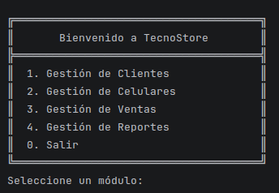

---

### Módulo Clientes

**Registrar Cliente**
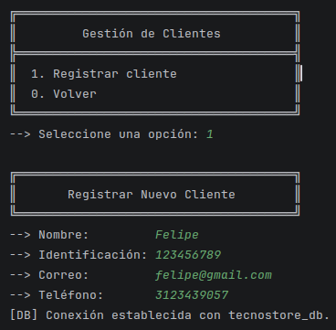

---

### Módulo Celulares

**Registrar Celular**
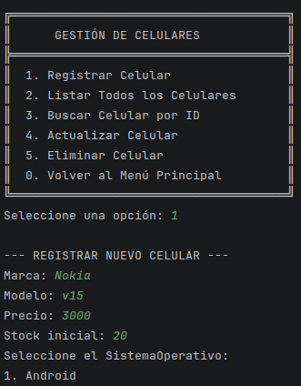

**Listar Celulares**
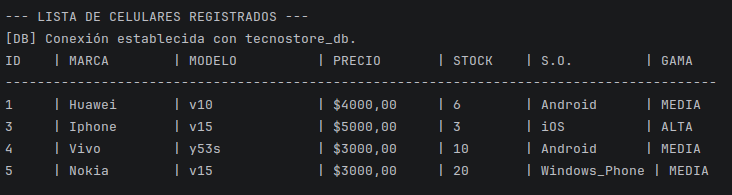

**Buscar Celular por ID**
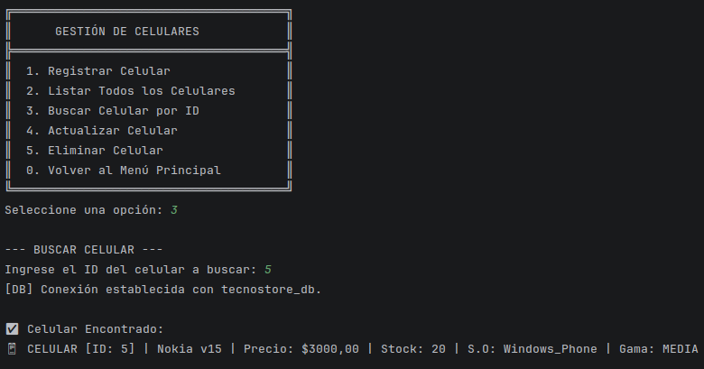

**Actualizar Celular**
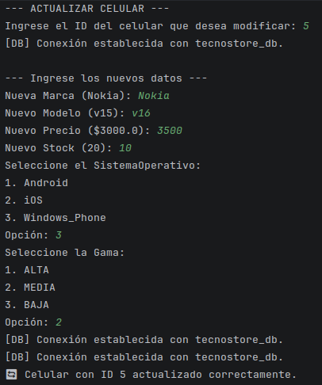

**Eliminar Celular**
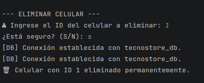

---

### Módulo Ventas

**Registrar Venta con IVA**
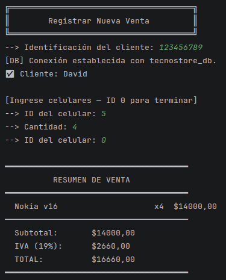

---

### Módulo Reportes

**Stock Bajo (< 5 unidades)**
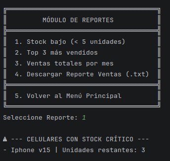

**Top 3 Más Vendidos**
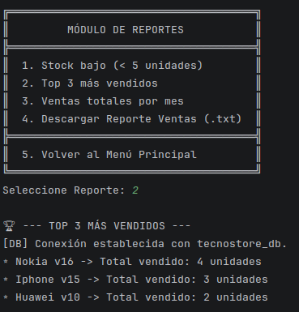

**Ventas Totales por Mes**
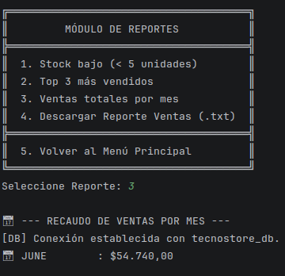

---

## ✅ Cumplimiento de Requerimientos del Enunciado

### 1. Gestión de Celulares
| Requisito | Clase / Método |
|---|---|
| Registrar celular | `GestorCelulares.registrar()` → `CelularDAOImpl.registrar()` |
| Actualizar celular | `GestorCelulares.actualizar()` → `CelularDAOImpl.actualizar()` |
| Eliminar celular (soft delete) | `GestorCelulares.eliminar()` → `CelularDAOImpl.eliminar()` (SET activo=false) |
| Listar celulares | `GestorCelulares.listar()` → `CelularDAOImpl.listar()` (WHERE activo=true) |
| Campos requeridos | Clase `Celular.java`: id, marca, modelo, precio, stock, sistemaOperativo, gama |
| Validar precio y stock positivos | `GestorCelulares.registrar()` — validación antes de persistir |

### 2. Gestión de Clientes
| Requisito | Clase / Método |
|---|---|
| Registrar cliente | `GestorClientes.registrarCliente()` → `ClienteDAOimpl.registrar()` |
| Campos requeridos | Clase `Cliente.java`: id, nombre, identificacion, correo, telefono |
| Validar formato de correo | `ValidadorCliente.esCorreoValido()` — regex `^[a-zA-Z0-9...]+@...` |
| Identificación única | `ValidadorCliente.esIdentificacionValida()` + `ClienteDAOimpl.existeIdentificacion()` |

### 3. Gestión de Ventas
| Requisito | Clase / Método |
|---|---|
| Seleccionar cliente y celular(es) | `VentaController.registrarVenta()` — flujo interactivo |
| Calcular IVA 19% | `GestorVentas.registrarVenta()` — `subtotalSum * (1 + 0.19)` |
| Actualizar stock al vender | `VentaDAOimpl.registrar()` — `UPDATE celulares SET stock = stock - ?` (transacción) |
| Guardar en BD con JDBC | `VentaDAOimpl.registrar()` — INSERT en `ventas` + `detalle_ventas` |
| Transacción atómica | `VentaDAOimpl` — `setAutoCommit(false)` / `commit()` / `rollback()` |

### 4. Reportes y Análisis con Stream API
| Requisito | Clase / Método |
|---|---|
| Stock bajo < 5 unidades | `GestorReporte.obtenerCelularesStockBajo()` — `.stream().filter(c -> c.getStock() < 5)` |
| Top 3 más vendidos | `GestorReporte.obtenerTop3CelularesMasVendidos()` — `.stream().flatMap().collect(groupingBy()).sorted().limit(3)` |
| Ventas totales por mes | `GestorReporte.obtenerVentasTotalesPorMes()` — `.stream().collect(groupingBy(v -> v.getFecha().getMonth(), summingDouble(...)))` |
| **Stream API** | Todos los cálculos de reportes usan `java.util.stream.Collectors` |
| **Lambdas** | Expresiones lambda en todos los `.filter()`, `.map()`, `.collect()`, `.sorted()` |
| **Colecciones** | `List<Celular>`, `List<Venta>`, `List<ItemVenta>`, `Map<Month, Double>`, `Map<Integer, Integer>` |

### 5. Persistencia y Archivos
| Requisito | Clase / Método |
|---|---|
| Generar `reporte_ventas.txt` | `ArchivoUtils.generarReporte()` — escribe resumen de ventas |
| **try-with-resources** | Todos los métodos de `ClienteDAOimpl`, `CelularDAOImpl`, `VentaDAOimpl` usan `try(PreparedStatement ps = ...)` |

### 6. Patrones de Diseño y Principios SOLID
| Requisito | Clase / Método |
|---|---|
| **Singleton** | `ConexionDB.getInstancia()` — una sola conexión en toda la aplicación |
| **Singleton** | `ScannerSingleton.getInstancia()` — un solo lector de consola |
| **S** — Responsabilidad única | Cada clase tiene una sola función: DAOs solo acceden a BD, servicios solo aplican reglas de negocio, vistas solo muestran datos |
| **O** — Abierto/Cerrado | Las interfaces `IClienteDAO`, `ICelularDAO`, `IVentaDAO` permiten agregar implementaciones sin modificar el código existente |
| **L** — Sustitución Liskov | `ClienteDAOimpl implements IClienteDAO`, `CelularDAOImpl implements ICelularDAO`, `VentaDAOimpl implements IVentaDAO` |
| **I** — Segregación de interfaces | Tres interfaces separadas: `IClienteDAO`, `ICelularDAO`, `IVentaDAO` — cada una con solo sus métodos |
| **D** — Inversión de dependencias | `GestorClientes(IClienteDAO)`, `GestorVentas(IVentaDAO, ICelularDAO, IClienteDAO)` — dependen de abstracciones, no de implementaciones concretas |
| **Encapsulamiento** | Todos los modelos tienen atributos `private` con getters y setters públicos |
| **Composición** | `Venta` contiene `List<ItemVenta>`; `ItemVenta` contiene `Celular`; `Venta` contiene `Cliente` |

---

## 👥 Autores

| Nombre       | Módulos                                    |
|--------------|--------------------------------------------|
| David Orozco | Clientes, Ventas, Configuración            |
| Felipe Corzo | Celulares, Menú Celulares, Enums, Reportes |

---

## 📁 Archivos Entregables

- `src/` — Código fuente completo en Java
- `tecnostore_db.sql` — Script de creación de tablas
- `reporte_ventas.txt` — Generado automáticamente desde el módulo de Reportes
- `README.md` — Este documento
- Capturas de pantalla de cada módulo en funcionamiento
